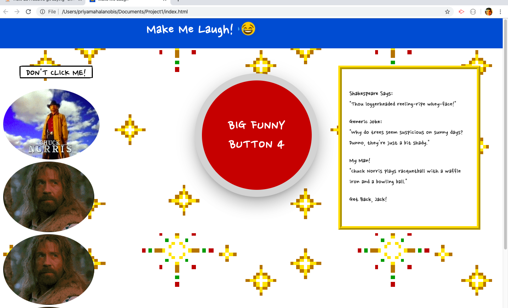

# Make Me Laugh!

1. Elevator Ptich

    The name of our application is Make Me Laugh. It's designed to be a "time-waster", and a website purely for fun. When users want to be entertained, they simply visit the site and click the on "big funny button" in the middle of hte page. Content is then generated on the page in the form of jokes, funny sounds, and gifs.

2. Concept

    Our user story is that of a person who wants to take a break from work or seriousness and simply be entertained. Since a typical day-to-day routine for many people makes them wish for a mental break at some point or another, part of a realistic "user story" is that the user, when using our application, doesn't want to take life too seriously. Our motivation for development was to create something fun and entertaining.

3. Process

    The three coding languages used in our website are HTML, CSS, and Javascript.

    CSS libraries: 
    - Animate.CSS used to animate things.
    - Materialize CSS: "A modern responsive front-end framework based on Material Design"
    - Google Fonts developer API

    Javascript APIs:
    - Giphy 
    - api.fungenerators.com (Shakespearian insults, nsfw insults)
    - joke3.p.rapidapi.com (randomized jokes)
    - geek-jokes.sameerkumar.website/api (Chuck Norris jokes)

    The roles and tasks were broken down so that Dan and Lilliana were in charge of the CSS aspects, while Dick and Priya were in charge of Javascript and API aspects.

    Challenges enountered were numerous. Reliable APIs were difficult to find for free. One API in particular offered four different categories of jokes, however each of those categories only provided one joke per day. Some of the jokes were not humorous or understandable, and those that were displayed weird squigly/jibberish characters.

    It was difficult finding free, reliable APIs which offered a wide variety of humorous content. We have generic jokes, Olde-English insults, Chuck Norris Jokes and gifs. However we wished to find additional types of humor (i.e. knock-knock jokes, humorous fortunes) and were unable to for free. 

    Successes came with work, and lots of trial-and-error. Successful aspects of our site include: the layout of its content (navbar on the left, button in middle and jokes on right), audio sounds triggered, changing backgrounds, a responsive button (runs away from the cursor at times), an animated crying-emoji in the header bar, responsive APIs that get content via AJAX calls, and a checkbox-based filter system.

4. Demo

5. Directions for Future Development

    Provided more time, a key additional aspect of future development would be the integration of more APIs and types of jokes. One of our team members (Dick) has a collection of humorous fortunes we wanted to incorporate; however, we didn't have the time to get it functioning as a server-side API. 

6. Links

    GH pages: <https://panamadan.github.io/Project1/>
    GH repository: <https://github.com/panamadan/Project1.git>

